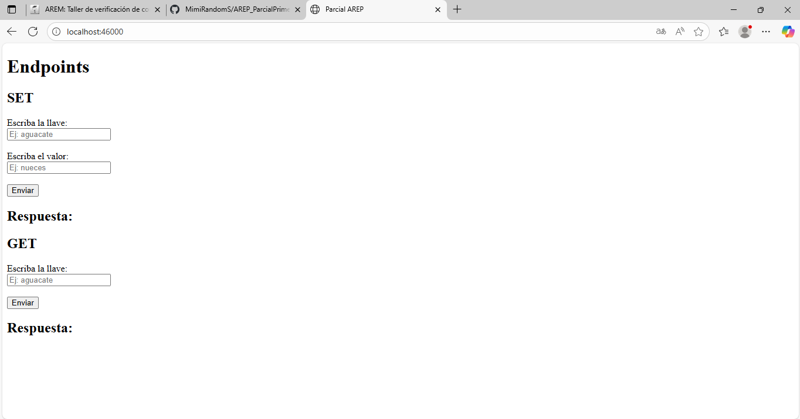
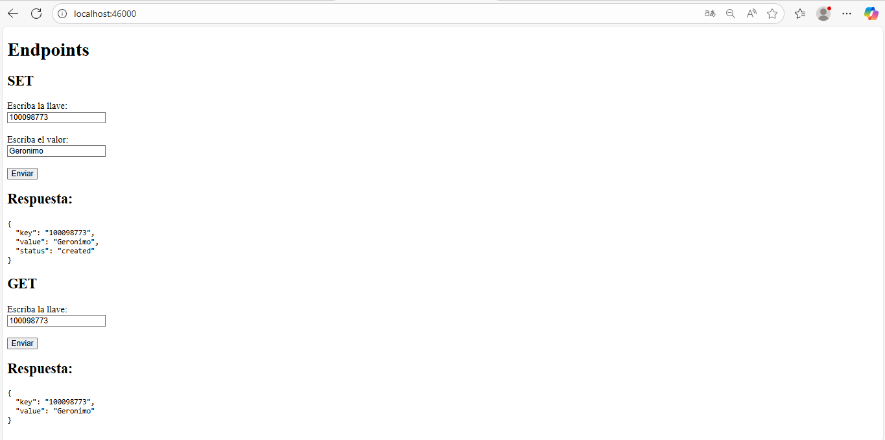

# Parcial primer tercio
#### Geronimo Martinez Nuñez

Para la ejecucion de proyecto siga los siguientes pasos.

1. Clone el repositorio
```bash 
git clone https://github.com/MimiRandomS/AREP_ParcialPrimerTercio
```

2. El proyecto consta de dos carpeta ``backend`` y ``facade`` para cada carpeta dirigase a su ``command promt`` preferido y ejecute las siguientes lineas.
``` bash
cd backend
mvn package
java -cp target/classes edu.eci.arep.backend.BackendApplication


cd facade
mvn package
java -cp target/classes edu.eci.arep.facade.FacadeApplication
```

3. Despues de encender ambos servidores ``backend`` y ``facade`` con su metodo preferido, acceda al enlace para consumir el servicio, si consume localmente debe usar le siguiente enlace
```
http://localhost:46000/
```
Este enlace corresponde al ``facade`` intermediario encargado de dirigir las peticiones hacia el ``backend`` y devolver el cliente web.



Consuma el servicio usando los formularios dispuesto en el cliente web



### Enlace del video:
[](https://youtu.be/rCziPW7PDZw)
