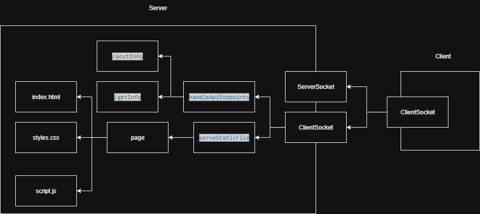
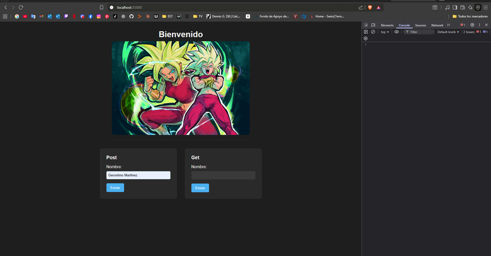
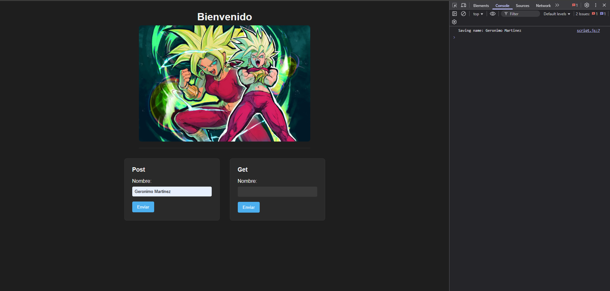
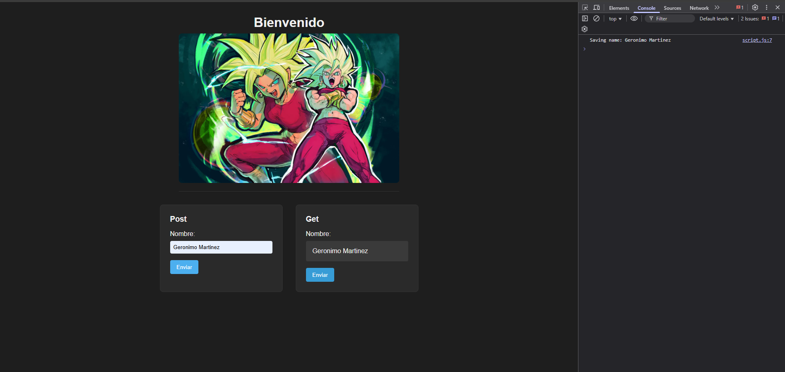

# Taller diseño y estructuración de aplicaciones distribuidas en internet

Este proyecto consiste en un servidor web básico implementado en **Java puro**, capaz de manejar múltiples solicitudes secuenciales (no concurrentes).  
El servidor puede servir archivos estáticos desde disco (`.html`, `.css`, `.js`, imágenes, etc.) y provee **servicios REST** que se comunican de forma asíncrona con la aplicación web construida en HTML, CSS y JavaScript.  
Este proyecto **no utiliza frameworks web** como Spring o Spark; se basa únicamente en las librerías de Java para manejo de red.

## Getting Started

Estas instrucciones te permitirán obtener una copia del proyecto en tu máquina local para desarrollo y pruebas.

### Prerequisites

Necesitas tener instalado:

- [Java JDK 17+](https://www.oracle.com/java/technologies/javase-jdk17-downloads.html)
- [Maven](https://maven.apache.org/)

### Architecture
El proyecto tiene la siguiente estructura:


### Installing

1. Clona el repositorio:

```bash
git clone https://github.com/MimiRandomS/AREP_taller1
cd AREP_taller1
````

2. Compila el proyecto usando Maven:

```bash
mvn compile
```

3. Ejecuta el servidor:

```bash
mvn exec:java -Dexec.mainClass="com.mimirandoms.arep1.HttpServer"
```

4. Abre tu navegador y prueba la aplicación web apuntando a `http://localhost:35000`.

---

## Running the tests

Este proyecto no incluye tests automatizados.
Para probar el servidor, simplemente abre la aplicación web en el navegador y realiza solicitudes:

* Envía datos al servicio REST `/app/postInfo` mediante el formulario de **POST**.
* Recupera datos mediante el formulario de **GET** en `/app/getInfo`.

Sin embargo, prueba local de que la aplicacion web funciona al usar `http://localhost:35000`. La aplicacion web cuenta dos formularios, uno encargado para POST y otro encargado para el GET, Adicionalmente contiene `styles.css` y una imagen para probar funcionalidad donde el servidor web esta usando correctamente los archivos. 

Al usar el formulario POST se prueba que se guarda el nombre en la base de datos. Donde un ``console.log`` imprime el nombre a guardar.

Y finalmente se usa el formulario GET donde se obtiene el ultimo nombre almacenado.


---

## Deployment

Para desplegar el servidor en un entorno en vivo, asegúrate de:

1. Abrir el puerto 35000 en el firewall.
2. Ejecutar el JAR compilado en un servidor con Java instalado.
3. Configurar la ruta base `page/` con los archivos estáticos (HTML, CSS, JS, imágenes).

---

## Built With

* [Java](https://www.java.com/) - Lenguaje principal
* [Maven](https://maven.apache.org/) - Gestión de dependencias y compilación
* [HTML/CSS/JS](https://developer.mozilla.org/) - Frontend básico

---

## Authors

* **Geronimo Martinez** - *Alias MimiRandomS* - [GitHub](https://github.com/MimiRandomS)


