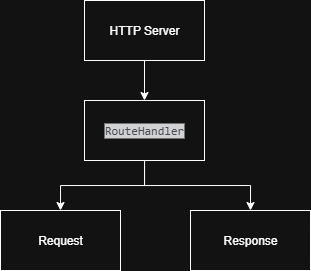

# Taller 2 – Framework Web en Java

Este proyecto consiste en un **framework web básico** implementado en **Java puro**, capaz de:

* Servir **archivos estáticos** (`.html`, `.css`, `.js`, imágenes, audio/video).
* Manejar **servicios REST** dinámicos definidos mediante **lambda functions**.
* Extraer **parámetros de query** de las solicitudes HTTP.
* Permitir a los desarrolladores definir la carpeta de **archivos estáticos**.

El proyecto **no utiliza frameworks web externos** como Spring o Spark; se basa únicamente en librerías nativas de Java (`java.net`, `java.io`, `java.nio`).

---

## Getting Started

### Prerequisites

* [Java JDK 17+](https://www.oracle.com/java/technologies/javase-jdk17-downloads.html)
* [Maven](https://maven.apache.org/)

### Installation

1. Clona el repositorio:

```bash
git clone https://github.com/MimiRandomS/AREP_taller2
cd AREP_taller2
```

2. Compila el proyecto:

```bash
mvn compile
```

3. Ejecuta el servidor:

```bash
mvn exec:java -Dexec.mainClass="com.mimirandoms.arep1.HttpServer"
```

4. Abre tu navegador en `http://localhost:35000`.

---

## Uso del Framework

### Configuración de archivos estáticos

Define la carpeta de archivos estáticos:

```java
HttpServer.staticfiles("page");
```

Los archivos dentro de esta carpeta podrán ser accedidos directamente:

* `http://localhost:35000/index.html`
* `http://localhost:35000/styles.css`
* `http://localhost:35000/image.png`

---

### Definición de REST endpoints

El framework permite registrar rutas con lambdas:

```java
HttpServer.get("/hello", (req, res) -> "Hello " + req.getValues("name"));
HttpServer.get("/pi", (req, res) -> String.valueOf(Math.PI));
```

* `req.getValues("name")` permite acceder a parámetros de query:
  `http://localhost:35000/hello?name=Pedro` → `"Hello Pedro"`

---

### Ejemplo completo de main

```java
public static void main(String[] args) throws IOException {
    HttpServer.staticfiles("page");

    HttpServer.get("/hello", (req, res) -> "Hello " + req.getValues("name"));
    HttpServer.get("/pi", (req, res) -> String.valueOf(Math.PI));

    HttpServer.start(35000);
}
```

---

## Arquitectura

El proyecto sigue una arquitectura **MVC simplificada**:

* **HttpServer**: punto de entrada, recibe solicitudes y enruta a endpoints o archivos estáticos.
* **Request**: parsea la solicitud HTTP y expone parámetros de query y body.
* **Response**: construye y envía la respuesta HTTP (soporta texto y binarios).
* **RouteHandler**: interfaz funcional para manejar endpoints dinámicos.


---

## Testing

Para probar el servidor:

1. Abre un navegador o usa `curl`.
2. Accede a endpoints REST definidos:

```bash
curl "http://localhost:35000/hello?name=Pedro"
curl "http://localhost:35000/pi"
```

3. Abre archivos estáticos:

* `http://localhost:35000/index.html`
* `http://localhost:35000/styles.css`
* `http://localhost:35000/image.png`

El framework servirá correctamente **archivos de texto y binarios**.

---

## Deployment

1. Abrir el puerto 35000 en el firewall.
2. Ejecutar el JAR compilado en un servidor con Java instalado.
3. Asegurarse de que la carpeta `page/` contiene los archivos estáticos requeridos.

---

## Built With

* [Java](https://www.java.com/) – Lenguaje principal.
* [Maven](https://maven.apache.org/) – Gestión de compilación y dependencias.
* HTML/CSS/JS – Frontend básico.

---

## Authors

* **Geronimo Martinez** – *Alias MimiRandomS* – [GitHub](https://github.com/MimiRandomS)
