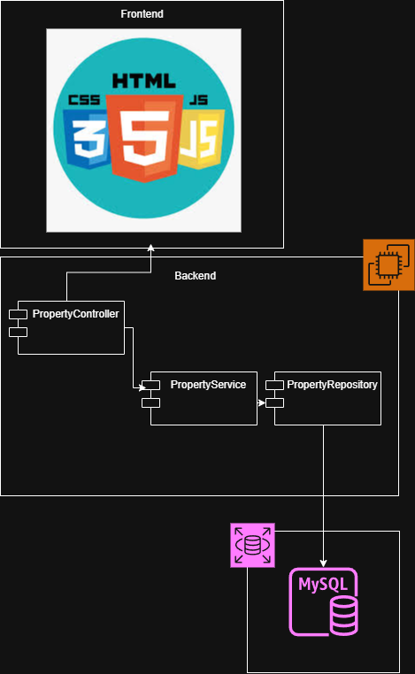
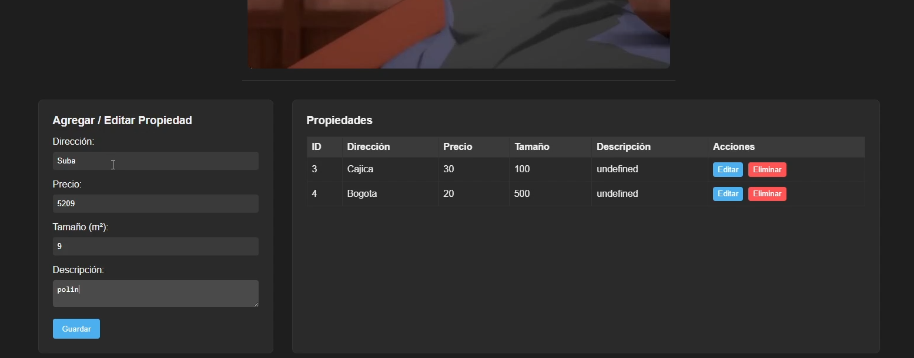

# Taller 5 – CRUD System to Manage Properties

Este proyecto implementa un sistema CRUD (Create, Read, Update, Delete) para gestionar propiedades inmobiliarias, usando **Spring Boot** para el backend, **MySQL** para la base de datos y **HTML + JavaScript** para el frontend. Todo está desplegado en **AWS** usando **Docker** y **EC2**.

## ✨ Funcionalidades principales

* Crear nuevas propiedades (dirección, precio, tamaño, descripción).
* Leer todas las propiedades o consultar una propiedad específica por ID.
* Actualizar propiedades existentes.
* Eliminar propiedades.
* Validación básica de campos en el frontend.
* Comunicación entre frontend y backend mediante **Fetch API**.

## 🏗️ Arquitectura del Sistema

* **Frontend**: HTML, CSS y JavaScript. Formulario para crear/editar propiedades y tabla para listar/editar/eliminar propiedades usando Fetch API.
* **Backend**: Spring Boot REST API con endpoints:

  * `POST /properties` → Crear propiedad
  * `GET /properties` → Listar todas las propiedades
  * `GET /properties/{id}` → Consultar propiedad por ID
  * `PUT /properties/{id}` → Actualizar propiedad
  * `DELETE /properties/{id}` → Eliminar propiedad
* **Base de Datos**: MySQL en RDS con tabla `properties` (id, address, price, size, description).
* **Despliegue**: Backend y base de datos en servidores separados en AWS. Frontend puede ser servido desde cualquier servidor o incluso localmente consumiendo el API público.

### Diagrama de Clases / Arquitectura


## 🚀 Getting Started

### 📋 Prerrequisitos

* Java 21 JDK
* Maven
* Docker
* Cuenta en DockerHub
* Instancia AWS EC2 con Docker instalado
* Instancia AWS RDS MySQL

### 🔧 Instalación y ejecución local

1. Clonar el repositorio:

```bash
git clone https://github.com/MimiRandomS/AREP_taller5
cd AREP-Taller5/Backend
```

2. Compilar el proyecto:

```bash
mvn clean package
```

3. Crear un archivo `.env` con las variables de conexión a la base de datos:

```
DB_URL=jdbc:mysql://<RDS-ENDPOINT>:3306/properties_db
DB_USER=AREP
DB_PASS=AREP1234
```

4. Ejecutar el backend localmente:

```bash
java -cp "target/classes:target/dependency/*" edu.ecu.arep.taller4.Taller4Application
```

5. Abrir el frontend en un navegador (`Frontend/index.html`) y conectar con el backend local o remoto.

### ⚡ Docker

**Construir la imagen:**

```bash
docker build -t mimirandoms/areptaller5:latest .
```

**Correr un contenedor:**

```bash
docker run -d --env-file .env -p 8080:8080 --name taller5-backend mimirandoms/areptaller5:latest
```

**Subir a DockerHub:**

```bash
docker tag mimirandoms/areptaller5:latest TUUSUARIO/areptaller5:latest
docker push TUUSUARIO/areptaller5:latest
```

### ☁️ Despliegue en AWS EC2

1. Conectarse a la instancia:

```bash
ssh -i "clave1.pem" ec2-user@<PUBLIC_IP_EC2>
```

2. Instalar Docker y agregar usuario:

```bash
sudo yum update -y
sudo yum install docker -y
sudo service docker start
sudo usermod -a -G docker ec2-user
exit
```

3. Descargar y correr la imagen:

```bash
docker pull TUUSUARIO/areptaller5:latest
docker run -d --env-file .env -p 8080:8080 --name taller5-backend TUUSUARIO/areptaller5:latest
```

4. Abrir el puerto 8080 en el **Security Group** de AWS y acceder al frontend que consume el API:

```
http://<PUBLIC_IP_EC2>:8080
```

## 🧪 Pruebas rápidas

* Crear una propiedad → formulario frontend → POST `/properties`
* Listar propiedades → tabla frontend → GET `/properties`
* Editar propiedad → botón "Editar" → PUT `/properties/{id}`
* Eliminar propiedad → botón "Eliminar" → DELETE `/properties/{id}`

## 📷 Capturas de pantalla



## 🎥 Video de demostración

<p align="center">
  <a href="https://youtu.be/mBkq0eCLdY0" target="_blank">
    
  </a>
</p>


## 🛠️ Tecnologías

* **Java** – Lenguaje principal.
* **Maven** – Gestión de dependencias.
* **Spring Boot** – Backend REST API.
* **MySQL** – Base de datos relacional.
* **Docker** – Contenedores.
* **AWS EC2 & RDS** – Despliegue en la nube.
* **HTML/CSS/JavaScript** – Frontend.

## ✍️ Autor

Geronimo Martinez – GitHub: [MimiRandomS](https://github.com/MimiRandomS)


