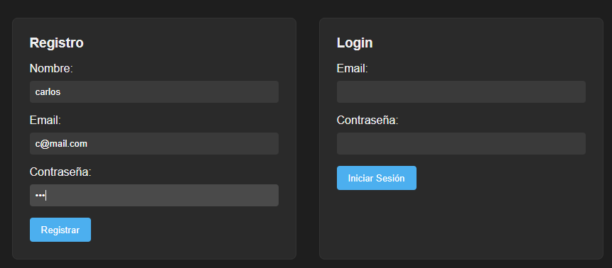
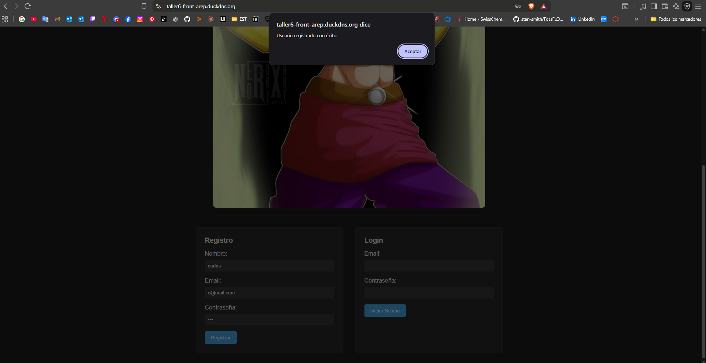
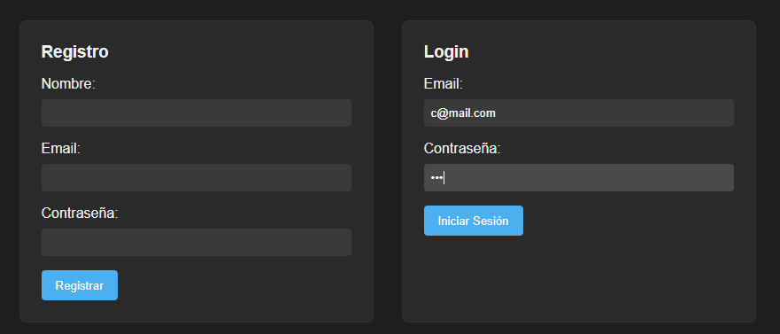
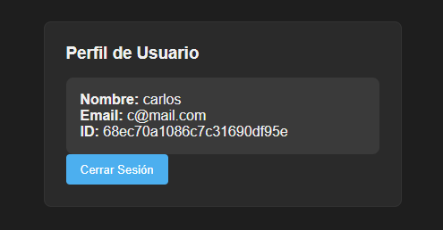
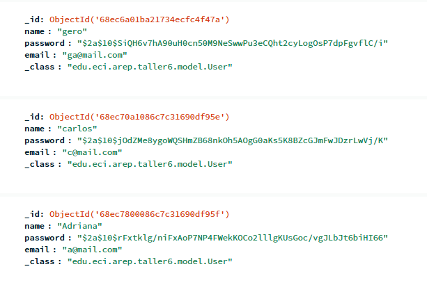

# Taller 6 – Secure Application Design

Este proyecto implementa una **aplicación segura y escalable** usando **Spring Boot** para el backend, **MongoDB** como base de datos, y **HTML + JavaScript asíncrono** para el frontend. Todo se despliega en **AWS** con **TLS** usando **Let’s Encrypt** para asegurar la comunicación entre cliente y servidor.

## ✨ Funcionalidades principales

* Registro de usuarios con **contraseña hasheada (BCrypt)**.
* Login con **JWT** para autenticación segura.
* Visualización del perfil del usuario tras iniciar sesión.
* Comunicación segura **frontend ↔ backend** usando HTTPS.
* Backend separado del frontend en servidores distintos, ambos certificados con Let’s Encrypt.
* Base de datos MongoDB externa, accesible desde el backend de forma segura.

---

## 🏗️ Arquitectura del Sistema

* **Frontend (Apache + HTML/JS)**

  * Sirve archivos HTML, CSS y JavaScript de forma asíncrona.
  * Realiza llamadas a la API backend mediante `fetch()` con HTTPS.
  * Maneja sesión con JWT guardado en `localStorage`.

* **Backend (Spring Boot + MongoDB)**

  * API REST segura (`/arep/register`, `/arep/login`, `/arep/profile`).
  * Contraseñas almacenadas en **hash**.
  * Validación de tokens JWT en endpoints protegidos.
  * Configuración CORS para permitir solicitudes del frontend.

* **Base de Datos**: MongoDB Atlas externa, colección `user`.

* **Seguridad TLS**: Ambos servidores tienen **certificados Let’s Encrypt**, asegurando confidencialidad e integridad de los datos.

---

### Diagrama de Arquitectura


---

## 🚀 Getting Started

### 📋 Prerrequisitos

* Java 21 JDK
* Maven
* Docker (opcional para empaquetar backend)
* Cuenta en AWS
* Instancias EC2 separadas para frontend y backend
* Certificados TLS generados con Let’s Encrypt para ambos dominios

---

### 🔧 Instalación y ejecución local del backend

1. Clonar el repositorio:

```bash
git clone https://github.com/MimiRandomS/AREP_Taller6
cd AREP_Taller6/Backend
```

2. Compilar el proyecto:

```bash
mvn clean package
```

3. Configurar variables de conexión a MongoDB en `application.properties`:

```properties
spring.data.mongodb.uri=mongodb+srv://<USUARIO>:<PASSWORD>@<CLUSTER>.mongodb.net/?retryWrites=true&w=majority&appName=Cluster0
spring.data.mongodb.database=arep
server.port=8080
jwt.secret=esta-es-una-clave-muy-larga-de-al-menos-256-bits-123456
```

4. Ejecutar el backend:

```bash
java -cp "target/classes:target/dependency/*" edu.eci.arep.taller6.Taller6Application
```

---

### 🔧 Instalación y ejecución del frontend

1. Servir el HTML/JS en **Apache** (ya certificado con TLS).
2. Asegurarse que `API_BASE` en `script.js` apunta al backend HTTPS:

```javascript
const API_BASE = "https://taller6-back-arep.duckdns.org/arep";
```

3. Abrir `index.html` en el navegador y probar registro/login.

---

### ⚡ Docker (opcional)

**Construir la imagen:**

```bash
docker build -t mimirandoms/areptaller6:latest .
```

**Correr un contenedor:**

```bash
docker run -d -p 8080:8080 --name taller6-backend mimirandoms/areptaller6:latest
```

**Subir a DockerHub:**

```bash
docker tag mimirandoms/areptaller6:latest TUUSUARIO/areptaller6:latest
docker push TUUSUARIO/areptaller6:latest
```

---

### ☁️ Despliegue en AWS EC2

1. Conectarse a la instancia backend:

```bash
ssh -i "clave.pem" ec2-user@<PUBLIC_IP_BACKEND>
```

2. Instalar Docker y ejecutar la imagen (si se usa Docker):

```bash
sudo yum update -y
sudo yum install docker -y
sudo service docker start
sudo usermod -a -G docker ec2-user
exit
```

3. Ejecutar contenedor backend:

```bash
docker pull TUUSUARIO/areptaller6:latest
docker run -d -p 8080:8080 --name taller6-backend TUUSUARIO/areptaller6:latest
```

4. Asegurarse que **Security Groups** permiten tráfico HTTPS (443) desde frontend.

---

## 🧪 Pruebas rápidas

* **Registro**: formulario frontend → POST `/arep/register`
* **Login**: formulario frontend → POST `/arep/login`
  → almacena JWT en `localStorage`
* **Perfil**: GET `/arep/profile` con `Authorization: Bearer <token>`

---

## 📷 Capturas de pantalla





---

## 🎥 Video de demostración

<p align="center">
  <a href="https://youtu.be/Lvuf7ZbQIb4" target="_blank">
    
  </a>
</p>

---

## 🛠️ Tecnologías

* **Java + Spring Boot** – Backend REST API
* **MongoDB** – Base de datos
* **HTML/CSS/JavaScript** – Frontend asíncrono
* **Docker** – Contenedores opcionales
* **AWS EC2** – Servidores separados
* **Let’s Encrypt** – TLS/HTTPS
* **JWT** – Autenticación segura

---

## ✍️ Autor

Geronimo Martinez – GitHub: [MimiRandomS](https://github.com/MimiRandomS)

---

Si quieres, puedo hacer **una versión lista para entregar con plantilla de carpetas, archivos `script.js`, `index.html`, Dockerfile y configs Spring Boot`**, exactamente lista para clonar y ejecutar en AWS.

¿Quieres que haga eso?
